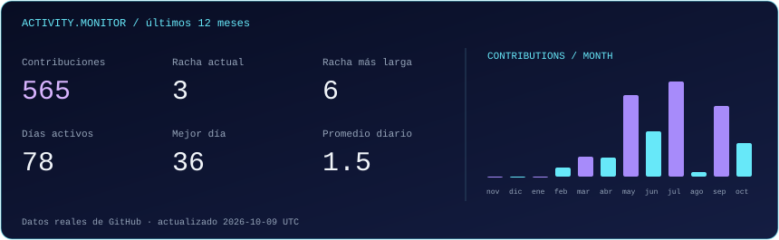

  <h3><code>tomas@github ~ $ ./contributions.sh</code></h3>
  
  <h3><code>tomas@github ~ $ whoami</code></h3>
  <table><tr>
    <td valign="top"></td>
    <td valign="top"></td>
  </tr></table>
    
  <a href="https://tomasghernandez.dev">Portafolio</a> ·
  <a href="https://linkedin.com/in/tomasghernandez">LinkedIn</a> ·
  <a href="mailto:devstomash@gmail.com">Contacto</a>

### Sobre mí

Soy **Tomás Hernández Oñate**, desarrollador Full Stack freelance y estudiante de **Ingeniería en Informática en la Universidad Bernardo O’Higgins**, en Santiago, Chile. Construyo aplicaciones web, APIs e integraciones que resuelven necesidades reales.

- **Desarrollo:** React, Next.js, TypeScript, Node.js y Express.
- **Datos e integraciones:** Supabase, MongoDB, MySQL, APIs REST y servicios de terceros.
- **Automatización e IA:** integración de APIs de IA y uso de Claude y Codex para apoyar el desarrollo, la revisión y la documentación.
- **Reconocimientos:** primer lugar nacional en el Rally Latinoamericano de Innovación (2025).
- **Formación adicional:** AWS Academy Graduate — Generative AI Foundations (2026).
- **Idiomas:** español nativo e inglés intermedio para documentación técnica.

### Proyectos y experiencia

| Proyecto | Mi trabajo | Ver más |
| --- | --- | --- |
| Portafolio personal | Presentación de proyectos, experiencia y stack tecnológico. | [Sitio web](https://tomasghernandez.dev) |
| Psiconectados | Desarrollo e integración de agendamiento, consentimientos digitales y pagos para una plataforma de atención psicológica. | [Sitio web](https://psicologarenataalonzo.cl) |
| Automatización y APIs | Scripts, integración de servicios y flujos para reducir tareas repetitivas. | [Repositorios públicos](https://github.com/thernandez530?tab=repositories) |

### Stack

**Frontend**

<table>
  <tr>
    <td align="center" width="110"> React</td>
    <td align="center" width="110"> Next.js</td>
    <td align="center" width="110"> TypeScript</td>
    <td align="center" width="110"> Tailwind CSS</td>
  </tr>
</table>

**Backend**

<table>
  <tr>
    <td align="center" width="110"> Node.js</td>
    <td align="center" width="110"> Express</td>
  </tr>
</table>

**Bases de datos**

<table>
  <tr>
    <td align="center" width="110"> Supabase</td>
    <td align="center" width="110"> MongoDB</td>
    <td align="center" width="110"> MySQL</td>
  </tr>
</table>

**Cloud y herramientas**

<table>
  <tr>
    <td align="center" width="110"> AWS</td>
    <td align="center" width="110"> Docker</td>
    <td align="center" width="110"> Railway</td>
    <td align="center" width="110"> Git</td>
  </tr>
  <tr>
    <td align="center" width="110"> GitHub</td>
    <td align="center" width="110"> Postman</td>
    <td align="center" width="110"> Figma</td>
  </tr>
</table>

**IA aplicada**

<table>
  <tr>
    <td align="center" width="110"> Claude</td>
    <td align="center" width="110"> Codex / OpenAI</td>
  </tr>
</table>

Iconos: <a href="https://github.com/devicons/devicon">Devicon</a> y <a href="https://github.com/simple-icons/simple-icons">Simple Icons</a>.

### Conversemos

Me interesan oportunidades de desarrollo de software, proyectos freelance e integraciones de automatización e IA.

**[Portafolio](https://tomasghernandez.dev)** · **[LinkedIn](https://linkedin.com/in/tomasghernandez)** · **[devstomash@gmail.com](mailto:devstomash@gmail.com)**

<!-- Artwork generated locally; implementation instructions are in PROFILE_SETUP.md. -->
